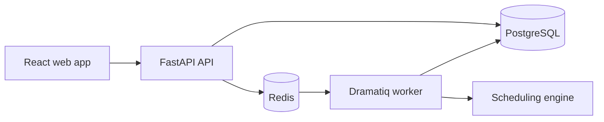

# Initial system architecture

Reroute will be kept in one repository so the frontend, API, scheduling engine
and local services can change together.

## Main parts



The React app will handle forms, the weekly calendar and schedule comparisons.
It will request work through the API and poll for schedule job updates.

The FastAPI app will validate requests, check ownership and coordinate database
work. Long schedule runs should be sent to the worker instead of making the API
request wait.

PostgreSQL will store users, planning inputs, schedule runs and version history.
Redis will only be used as the background job broker.

## Scheduling boundary

The scheduling engine should use normal Python domain objects. It should not
know about FastAPI requests, SQLAlchemy sessions or frontend components.

Keeping this boundary clear means the solver can be tested with small examples
without starting the rest of the application.

## Initial repository layout

```text
Reroute/
  apps/
    api/
    web/
  docs/
  compose.yaml
  README.md
```

Folders should only be added when the related work actually starts.
