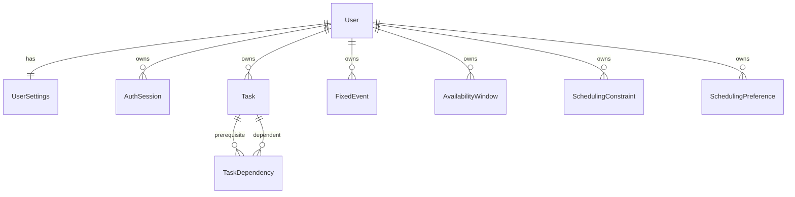

# Scheduling domain model

Reroute keeps persisted records separate from the objects passed into the
scheduling engine. Database models handle storage and ownership. Domain objects
contain the rules needed to validate and solve a schedule.

## Current records

## Users and sessions

A user stores the timezone used for local scheduling rules. The first target
timezone is `Australia/Sydney`, while persisted event timestamps use UTC.

Authentication sessions store only a SHA-256 hash of the random browser token.
Sessions are revocable and have an expiry time.

## Fixed events

Fixed events represent commitments such as classes, shifts and appointments.
Travel time before and after an event expands the time it blocks. Two events
can conflict even when their visible start and end times do not overlap.

Recurring events keep their recurrence rule on the parent record. Occurrences
will be expanded only for the active planning horizon.

## Flexible tasks

A flexible task keeps separate values for:

- estimated duration
- remaining duration
- actual duration
- minimum session length
- preferred session length
- maximum session length

Tasks can be splittable or continuous. A non-splittable task must fit inside
one eligible window. Dependencies form a directed graph and cycles are rejected
before work reaches the solver.

## Availability

Availability windows describe the local weekday and time range where flexible
work may be placed. Optional effective dates allow temporary schedules without
changing the ordinary week.

Unavailable periods will remain separate because they remove time rather than
granting it.

## Constraints and preferences

Constraints are mandatory rules. The solver must return an infeasible result
instead of breaking one.

Preferences are weighted goals. A higher weight makes a preference more
important, but it does not turn that preference into a mandatory rule.

The initial preference kinds include:

- avoiding late work
- compacting occupied days
- using preferred focus periods
- preserving free evenings
- reducing context switching
- keeping schedule revisions stable

## Ownership

Every planning record belongs to one user. API repositories filter by the
authenticated user identifier instead of loading a record first and checking
ownership later.

This matters even for a personal self-hosted application because it keeps the
data boundary correct if another local account is added later.
