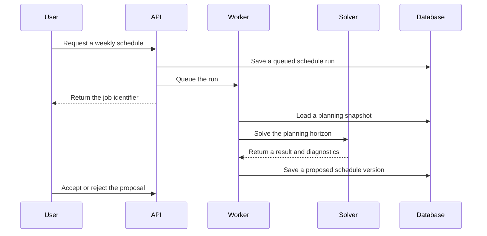

# Scheduling and recalculation flow

Reroute should save each generated schedule as a separate version. A new result
must not overwrite a schedule the user has already accepted.

## Initial schedule generation



If the workload cannot fit, the solver should return an infeasible result with
the main reasons. It should never weaken a mandatory rule without the user
choosing to change that rule.

## Recalculation after a disruption

When something changes, Reroute should keep past work, completed blocks and
locked blocks where they are. Only the remaining planning horizon should be
sent back through the solver.

```text
save the disruption
  -> apply the immediate change
  -> queue a recalculation
  -> preserve protected schedule blocks
  -> solve the remaining week
  -> compare the old and proposed versions
  -> explain what moved and why
  -> wait for the user to accept or reject it
```

The recalculation score should include a penalty for unnecessary changes. This
keeps a small disruption from rearranging unrelated work across the whole week.

The first version will use structured disruption forms. Natural language can be
added later as a convenience layer, but it should always produce a structured
proposal for the user to confirm.
